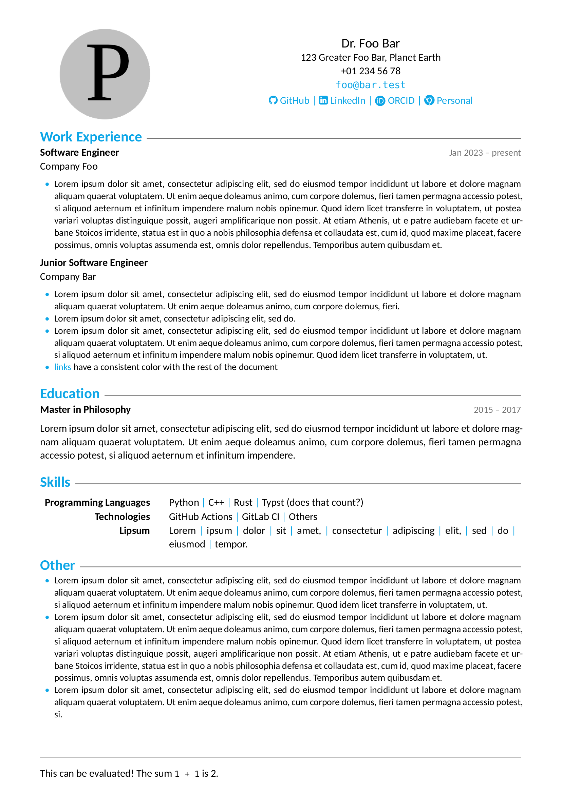

# typst CV template

This is a (mostly ATS-friendly) typst CV template which was initially based on [this LaTeX template](https://github.com/muratcankaracabey/latex_cv).
I wanted to learn a bit of typst, so I figured why not make a CV template.

## How to use

See the [example `main.typ`](example.typ) file for usage examples.

This should produce something like this:

Or, if you want to see the PDF, [click here](example.pdf).

Note that as the typst package manager [doesn't support templates yet](https://github.com/typst/packages#user-content-templates), this package is not available there, so it's probably easiest to `git clone` this repo and edit the `example.typ` file to your liking.

## Known issues

- as typst doesn't support user-defined objects yet, calling the functions in the template requires that the user passes the `color` arguments in case the defaults are changed
- the image must be modified manually (via some external program) until [this feature](https://github.com/typst/typst/pull/2338) makes it to a typst stable release

## License

MIT
